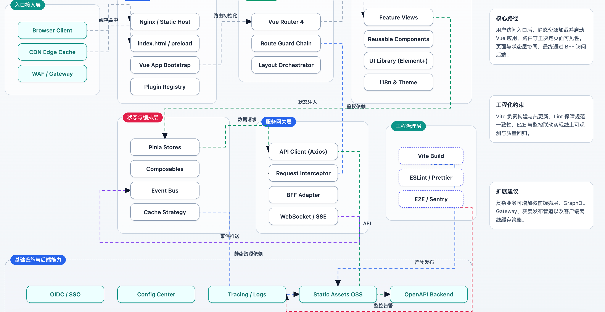
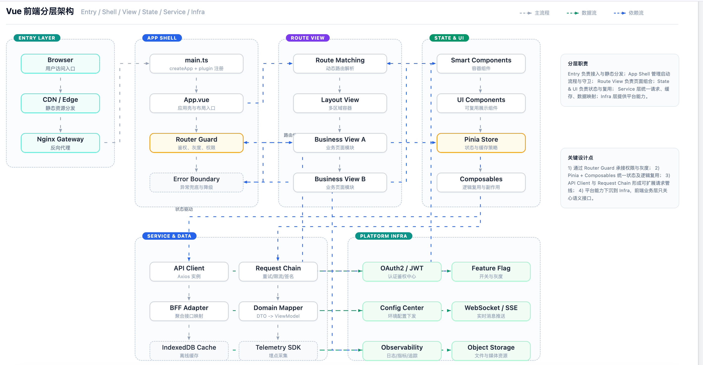

# Agent Skills / AI 技能集

[English](#english) | [中文](#中文)

---

<a name="english"></a>
## English

A collection of professional skills for AI agents.

### Skills

#### architecture-diagram

Generate professional HTML architecture diagrams with collision-free layout, clear connections, and unified styling.

**Install:**
```bash
npx skills add https://github.com/CryoThrust/agent-skills --skill architecture-diagram
```

**Features:**
- Pixel-perfect layout with collision detection
- Professional color system (7 color schemes)
- Clear connection lines with smart routing
- Responsive design
- AI-driven intelligent layout
- Support for various architecture types:
  - Frontend (Vue/React)
  - Microservice
  - Backend Layered
  - Deployment
  - Data Architecture

### Example Outputs

**Sample 1:**



Effect: Uses a card-based visual style with clear hierarchy and balanced spacing. Nodes and connectors are easy to scan, making system boundaries and interaction paths easy to understand at a glance.

**Sample 2:**



Effect: Shows a denser topology while preserving readability through consistent alignment, stable color contrast, and clean routing between components.

**Author:** lihongyan (Y0hanes@Outlook.com)

---

<a name="中文"></a>
## 中文

专业的 AI 技能集合。

### 技能

#### architecture-diagram

生成专业的 HTML 架构图，具有无碰撞布局、清晰的连接线和统一的样式风格。

**安装：**
```bash
npx skills add https://github.com/CryoThrust/agent-skills --skill architecture-diagram
```

**特性：**
- 像素级精准布局，自动碰撞检测
- 专业配色系统（7种配色方案）
- 清晰的连接线，智能路由
- 响应式设计
- AI 驱动的智能布局
- 支持多种架构类型：
  - 前端架构（Vue/React）
  - 微服务架构
  - 后端分层架构
  - 部署架构
  - 数据架构

### 示例效果

**示例 1：**


效果说明：采用卡片化视觉风格，层级清晰、间距均衡。节点和连线一目了然，系统边界与交互路径更容易快速理解。

**示例 2：**


效果说明：在组件较密集的拓扑下，依然通过统一对齐、稳定配色对比和整洁连线路由保持可读性。

**作者：** lihongyan (Y0hanes@Outlook.com)

---

## License / 许可证

MIT
